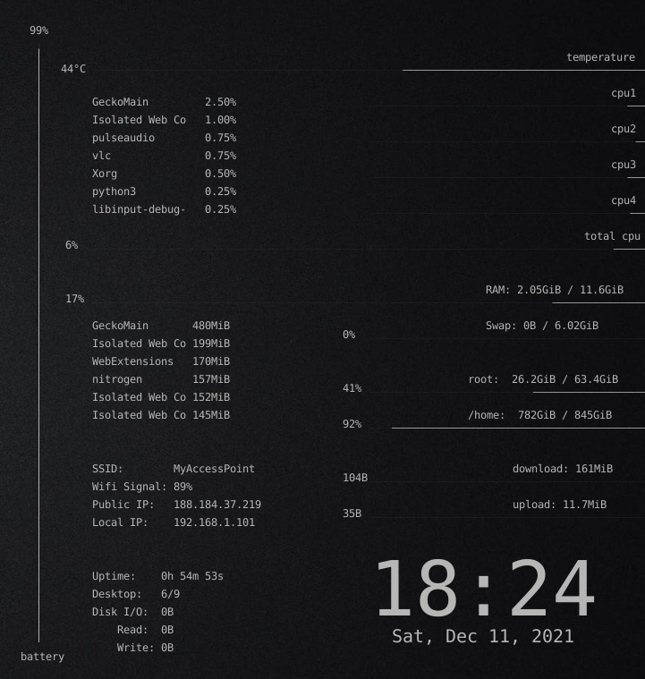
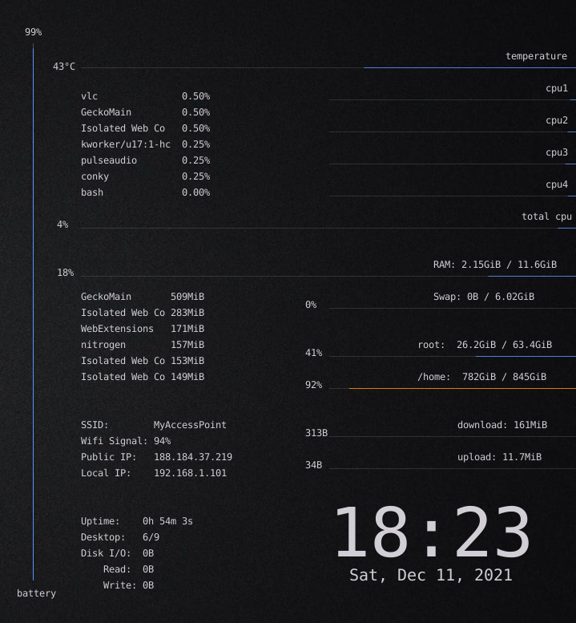
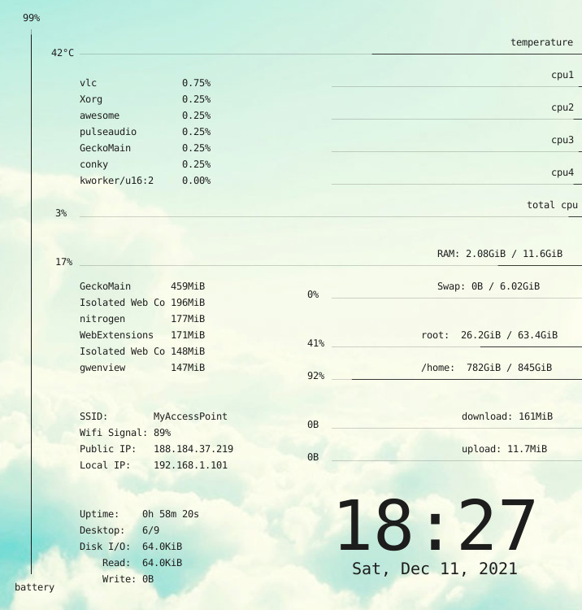
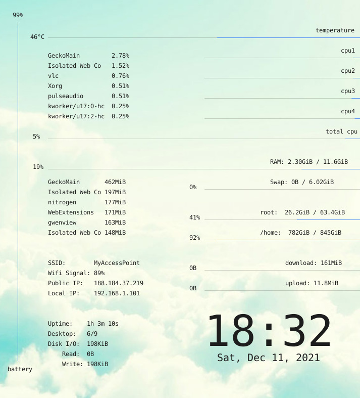

# Pomaria-Side Conky

Pomaria-side is a conky theme that displays system resources usage in fine lines, on the side of the screen.


## Screenshots

### For dark themes

##### monochrome dark



##### blue dark



***

### For light themes

##### monochrome light




##### blue light




More colors schemes are available. Choose a color from the `settings.lua` file and restart conky to take effect.

***


## Download and Launch

```sh
git clone https://www.github.com/SZinedine/pomaria-side
cd pomaria-side
conky -c conkyrc
```

Edit `settings.lua` to choose your network interface, Internet speed and other settings.

***

## Dependencies

- Conky 1.10+
- cairo
- imlib2

